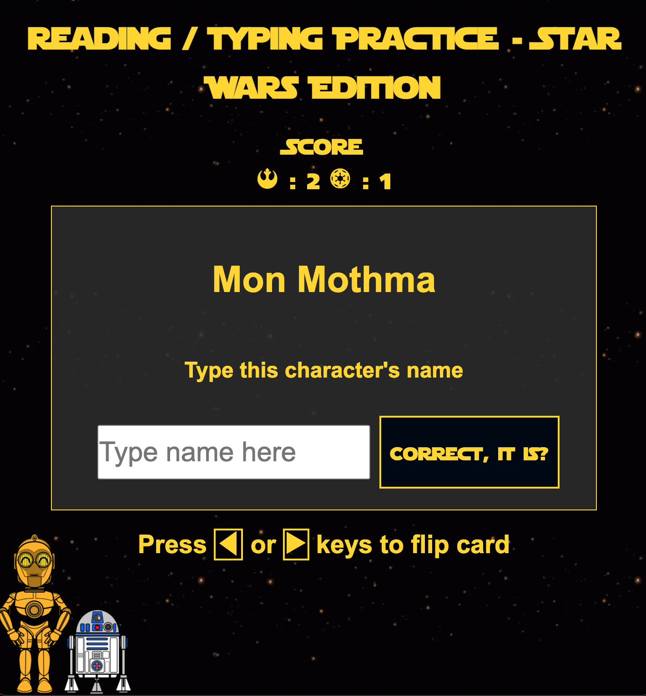

# Star Wars Typing Game

## Technologies Used

* HTML
* CSS
* Javascript
* SWAPI

## User stories

* As the student, I want to be able to use specificed keyboard keys to flip the card from the front to back and vice versa.
* As the student, I want to see a large input bar so I can practice typing the Star Wars character's name that I see within it. 
* As the student, I want to have some notification or acknowledgement if I typed the name correctely or not. 
* As the student, I want to have a button clearly visible and accessible so that I can click it to get to the next card once I successfully answer the prompt correctly. 
* As the student, I want to hear a sound or positive reinforcer if I answered the question correctly.
* As the educator, I want to have a response counter to track how many times the student answers correctly or incorrectly for data collection purposes. 

## Wireframes

## Unsolved problems

* The enter button will not work within the input bar regardless I tried creating a function for it and adding the event.PreventDefault(). If the enter button is pressed, it will refresh the whole screen and reset the score board. 

## Major Hurdles

* Getting a random name from SWAPI took some time to figure out since when I first tested with the generate name button, it would only work once and wouldn't generate a random name each time I clicked the button. After spending several hours of trying to figure how to get the button to work each time, I found out that I had to place the randomId variable before the SWAPI url is declared within the fetch or getData function. Once I did that, the generate name button worked every time with a new name generated with each click. 
* It took me a long time to get the flip transition right on the card. I had to research a lot on how it could be done within CSS. After a lot of trial and error, I was able get a successful card flip triggered by the left and arrow arrows on the keyboard. References that helped me create the flip transition are listed below.  

## References

* https://swapi.dev/documentation#people (SWAPI)
* https://www.w3schools.com/howto/howto_css_flip_card.asp (Used to help style my card flip)
* https://www.101soundboards.com/boards/10715-darth-vader-soundboard-star-wars# (Darth Vader sound effect)
* https://www.mediacollege.com/downloads/sound-effects/star-wars/lightsaber/ (Lightsaber sound effect)
* https://www.pngfind.com/mpng/mimxRw_star-destroyer-clipart-transparent-background-c3po-clipart-hd/ (C-3P0 and R2-D2 image)
* https://gifs.com/gif/4k-blinking-stars-request-2160p-1080p-background-animation-stock-KeBY2b (Starry background gif)
* https://www.eventeny.com/company/product/?p=25061 (Han Solo image)
* https://www.themarysue.com/meet-and-greet-baby-yoda/ (Grogu image)

## Project URL

https://sw-typing-game.herokuapp.com/
